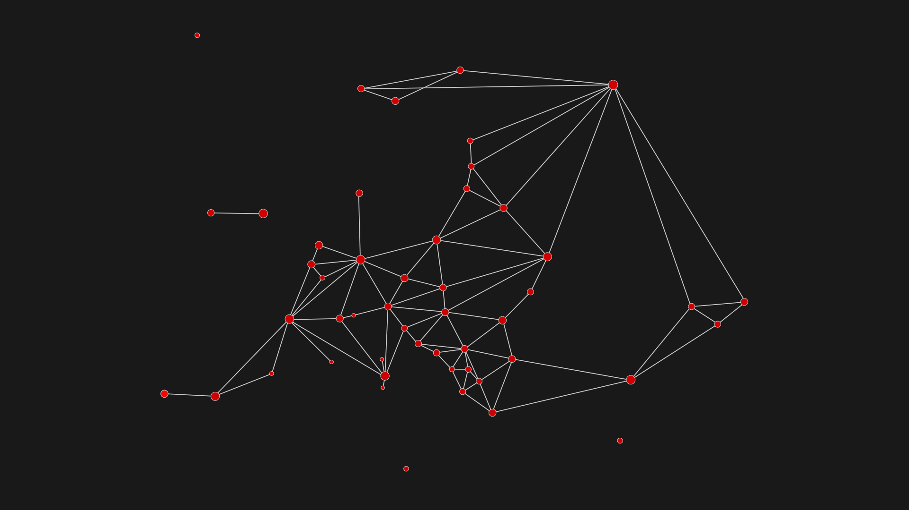
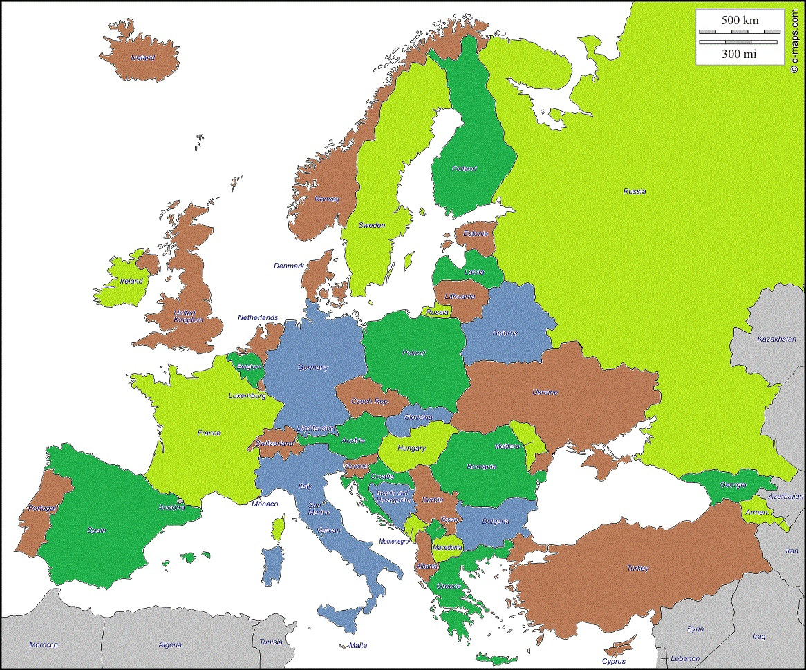
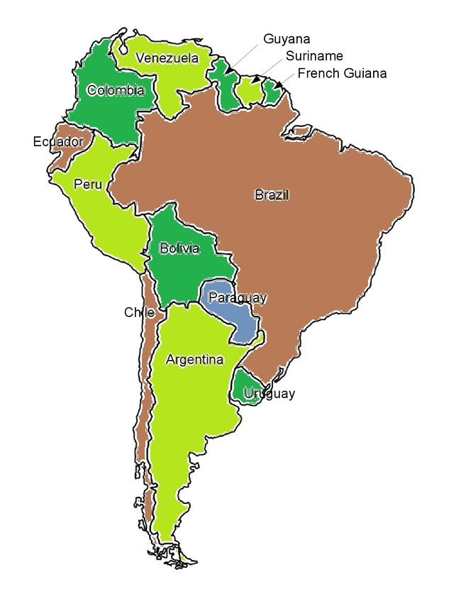

# ISEP-ESINF-2019
-------------

Projects of ESINF unit course

Language used: Java

Each project has a statement on 'Statements' folder.

2nd Project - Capitals Graph

2nd Project - Europe '4 Color Theorem' [1] solution proposal.

2nd Project - South America '4 Color Theorem' [1] solution proposal.

----------------

#### References
[1] - https://en.wikipedia.org/wiki/Four_color_theorem